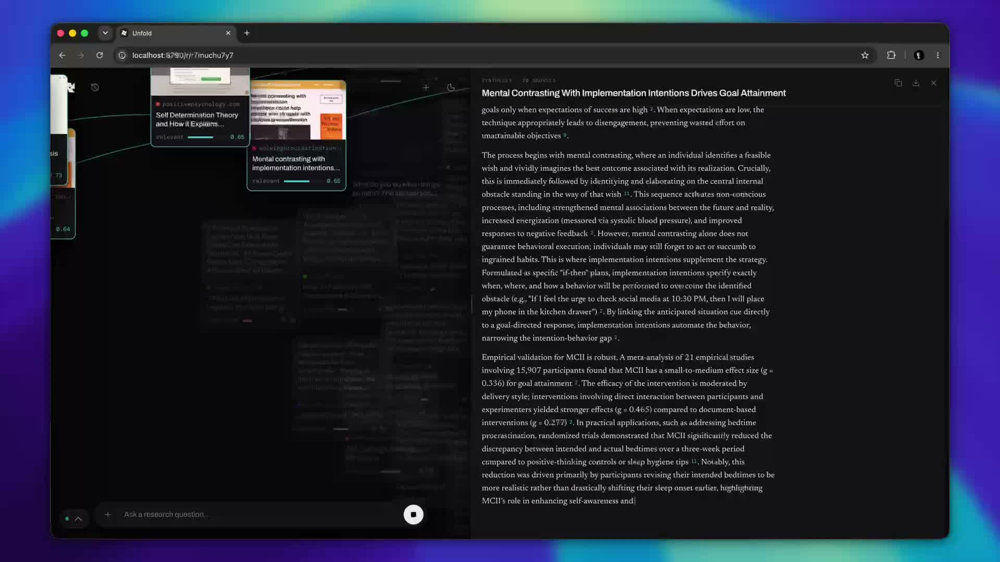

# Unfold — deep research on Jev

A depth-crawling research agent built to find out what a **System One model**
is good for. Jev ([TypeSafe AI](https://typesafe.ai)) generates no text: you
hand it a state and typed questions — a choice, a score, a yes/no — and get
calibrated probabilities back in one forward pass, in a few hundred
milliseconds, for a fraction of a cent. That turns out to be exactly the shape
of every decision a research crawl has to make per page.

https://github.com/tashfeenahmed/jev-deepresearch/raw/main/docs/demo.mp4

[](https://github.com/tashfeenahmed/jev-deepresearch/raw/main/docs/demo.mp4)

*A depth-2 run, first 1:09 at 2× speed. Music: Mozart, Symphony No. 40, Musopen Symphony Orchestra (public domain).*

A depth-crawling research agent. One question goes in; pages fan out across a
canvas, get scored for relevance one by one, and the survivors converge into a
written report.

The split is the whole point:

```
  Qwen 3.6 Plus          twice per run          plan the searches, write the report
  Jev 1.13.0             once per page          is this relevant? which link next?
  SearXNG                once per query         find the pages
```

Every per-page decision is a **choice between known options**, which is what Jev
is for — so the expensive model is called twice, not thirty times. A depth-8 run
costs roughly a cent.

## Run it

```bash
npm install
npm run tunnel      # separate terminal: forwards the Pi's SearXNG to :8888
npm start           # http://localhost:8790
```

Copy `.env.example` to `.env` and fill in the two keys (TypeSafe for Jev,
OpenRouter for the writing model). Nothing is forwarded to the browser — every
outbound call is made from the server process.

### The tunnel

Web search goes through a [SearXNG](https://github.com/searxng/searxng) node.
Mine is bound to loopback on another machine, so `npm run tunnel` forwards it
over SSH (set `SEARXNG_SSH_HOST=user@host`):

```
ssh -N -L 8888:127.0.0.1:8888 user@your-searxng-host
```

Without it, a run fails on the first search with a message saying so. Point
`SEARXNG_URL` at any SearXNG instance with the JSON format enabled instead.

## How a run goes

1. **Plan** — Qwen turns the question into 4–6 searches. The user's own wording
   is always the first query: if they named something the model doesn't
   recognise, that's the query that still finds it.
2. **Search + triage** — SearXNG runs them; one Jev request scores every hit
   from its title and snippet, so the obviously-wrong ones are never fetched
   and the promising ones are read first.
3. **Read** — `CONCURRENCY` workers each take the best queued page, fetch it,
   strip it to text, and ask Jev one request with four typed questions:
   `on_topic`, `has_primary_data`, `worth_expanding`, and a 4-level `relevance`
   score normalised to 0–1. Code applies the threshold; the model never decides
   policy. Nothing waits for a "ring" to finish — a slow page holds up one
   worker, not the crawl.
4. **Descend** — a kept page's outbound links get a yes/no each, all in one
   request; the top few are queued at priority *page relevance × link
   confidence*. Jev cannot invent a URL because the only answers that exist
   are the ones offered — the same reason `jev-ultrafast` hands it element
   ids rather than coordinates.
5. **Widen, while reading** — every verdict updates a per-query yield table
   (found / kept / cut / unreachable / skipped). Whenever the queue holds
   fewer pages than the workers can chew through and the run is still short
   of its source target, Qwen is handed that table — plus the hosts and titles
   that produced keepers — and asked for new queries that borrow the
   vocabulary that worked and point it somewhere new. Those are searched and
   triaged alongside the reading, so the new pages land before anyone is idle.
   One widening at a time; each one has seen every verdict before it.
6. **Converge** — the run stops starting pages once the target is met; kept
   pages drain back down their own branches and Qwen writes the report from
   their text with `[n]` citations.

Discarded pages are never expanded, so a deep run narrows into tendrils
instead of exploding.

## Settings

| env | default | |
|---|---|---|
| `THRESHOLD` | `0.62` | relevance at or above this is kept and expanded |
| `TRIAGE_FLOOR` | `0.15` | a search hit scoring below this on its snippet is never fetched |
| `MAX_PAGES` | `120` | hard stop on a run |
| `MIN_SOURCES` | `10` | default source target (the UI slider overrides it) |
| `MAX_WAVES` | `6` | batches of queries a run may issue, the planned one included |
| `PER_PAGE_LINKS` | `3` | children Jev may pick from one page |
| `CONCURRENCY` | `18` | pages in flight at once (fetch + judge) |
| `PAGE_CHARS` | `14000` | text kept per page; the report reads it in full |
| `MAX_SOURCES` | `40` | sources handed to the report |
| `LLM_REASONING` | off | see below |

**Qwen 3.6 is a reasoning model.** Left alone it spends the entire completion
budget thinking and returns empty content — that is not a bug in this code, it
is what `finish_reason: stop` with 247 of 261 tokens in `reasoning` looks like.
Calls send `reasoning: {enabled: false}`, which answers directly and costs about
**20× less** ($0.0002 vs $0.0043 on the planning call). `LLM_REASONING=on`
restores it.

## API

```
GET  /api/health                  config and whether keys are present
POST /api/run                     {goal, depth, minSources} -> {id}
GET  /api/run/:id/events          SSE: phase, plan, log, engines, node, node:state,
                                  node:verdict, node:shot, stats, gather,
                                  report:begin, report:token, report, warn,
                                  error, done, end
POST /api/run/:id/stop            abort
```

The event stream is replayed from the start to a late subscriber, so reloading
the page mid-run picks the crawl back up.

## Measured

Depth 3, target 14, *"Compare Playwright, Cypress and Selenium for end-to-end
testing in 2026"*, 22 Sep 2026:

```
crawl 26 s · 48 fetched · 17 kept · 30 cut · 1 unreachable · 8 never fetched
63 Jev calls · 438 ms avg · 127k tokens · $0.005
3 query batches; the second was planned at 11 s with 18 pages still in flight
report 81 s: 7 sections, 2 tables, 17 cited sources · total $0.039
```

The same question on the wave-at-a-time crawl this replaced: 120 fetched,
2 kept. A deep run capped each ring at `maxPages/depth + 4` pages and threw
the rest of the frontier away, so at depth 25 it read 9 of every ~48 search
hits and re-planned — six times.

Unreachable pages are 403s from bot protection and client-rendered pages with
no text in the HTML; those two cases get a second try in headless Chromium.
They show on the canvas as dashed cards with the reason.

## Layout

```
server/config.js   settings + .env reader
server/search.js   SearXNG client, ported from OPC's providers/searxng.ts
server/page.js     fetch + text extraction + outbound links
server/jev.js      triage(), judge(), pickLinks() — the decision calls
server/llm.js      plan(), expand(), report() — the generation calls
server/crawl.js    the run: the queue, the workers, the widener, convergence
server/shots.js    headless Chromium: browser fallback for reads, thumbnails
server/index.js    express + SSE
client/index.html  canvas, dock, report drawer
client/app.js      live layout, camera, report rendering
```

## Licence

MIT. Thumbnails and page text fetched during a run stay in `data/` on your
machine and are never committed.
